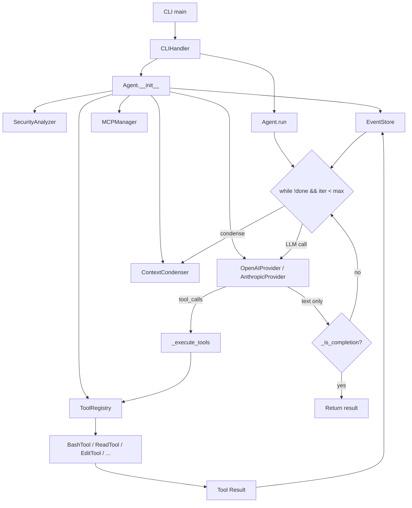

# Competitive Architecture Audit — Super Agent v17

**Generated**: 2026-03-14
**Auditor**: Automated Architecture Audit Pipeline
**Subject**: super_agent v17.0.0 (~3,465 LOC across 10 files)

---

## PHASE 0: BOOTSTRAP

```
Python 3.13.12  ✅
curl 8.14.1     ✅
Sandbox         ✅ operational
Repomix parsed: 10 files, 35 classes, 93 functions
```

---

## PHASE 1: CODEBASE ANALYSIS

### 1.1 Structural Scan

| File | Lines | Classes | Functions |
|---|---|---|---|
| `super_agent/__init__.py` | 82 | 0 | 0 |
| `super_agent/core.py` | 464 | 9 | 23 |
| `super_agent/agent.py` | 528 | 2 | 20 |
| `super_agent/cli.py` | 417 | 2 | 16 |
| `super_agent/providers.py` | 382 | 6 | 17 |
| `super_agent/tools/__init__.py` | 541 | 10 | 28 |
| `super_agent/mcp.py` | 378 | 6 | 25 |
| `demo_v17.py` | 311 | 3 | 11 |
| `README.md` | 188 | — | — |
| `pyproject.toml` | 63 | — | — |

**Key classes:** Agent, AgentConfig, AgentState, ContextCondenser, SecurityAnalyzer, EventStore, ToolRegistry, OpenAIProvider, AnthropicProvider, MCPManager, MCPServer

### 1.2 Architecture Table

| Aspect | Finding | Location |
|---|---|---|
| Main agent loop | Single-threaded async while-loop, max_iterations guard | `agent.py:834` `Agent.run()` |
| Tool registry & dispatch | Dict-based registry, sequential tool execution | `tools/__init__.py` `ToolRegistry` |
| LLM call wrapper | httpx-based, OpenAI/Anthropic/OpenRouter support | `providers.py` `OpenAIProvider.complete()` |
| Edit mechanism | Simple `str.replace()` — exact match only, single occurrence | `tools/__init__.py:2273` `EditTool.execute()` |
| Context management | Char-based token estimation (÷4), naive middle-drop condensation | `core.py:523` `ContextCondenser` |
| Error recovery | Generic `except Exception` — no retry, no classification | `agent.py:869` |
| State persistence | Event store with JSON serialization | `core.py:400` `EventStore` |
| Token/cost tracking | Token count stored in AgentState but no cost estimation | `core.py:467-468` |
| Streaming support | SSE parsing for OpenAI-compatible, fake stream for Anthropic | `providers.py:1750, 1912` |
| Test coverage | Demo file only (`demo_v17.py`), no pytest suite | `demo_v17.py` |

### 1.3 Architecture Diagram



### 1.4 Top 5 Weaknesses (Ranked by Severity)

```
WEAKNESS #1: No retry/backoff on LLM failures — any HTTP error kills the session — severity HIGH
WEAKNESS #2: Naive context condensation loses critical reasoning — just lists tool names — severity HIGH
WEAKNESS #3: No stuck/loop detection — agent can repeat same failing action forever — severity HIGH
WEAKNESS #4: No tool result truncation — a single large bash output can overflow context — severity MEDIUM
WEAKNESS #5: No cost tracking — no budget enforcement, no per-model cost estimation — severity MEDIUM
WEAKNESS #6: Exact-match-only edits — fails on any whitespace difference, no fuzzy fallback — severity MEDIUM
```

---

## PHASE 2: TARGETED COMPETITOR RESEARCH

### 2.1 Aider (`paul-gauthier/aider`)

#### Chat History Compression
- **File**: `aider/history.py` (verified ✅)
- **Mechanism**: `ChatSummary` class uses a cheap LLM to summarize conversation history. It recursively splits the message list, keeping tail messages intact and summarizing the head. Uses actual token counts (not char estimation).
- **Key technique**: Recursive split-and-summarize — keeps recent context verbatim while compressing old context via LLM.
- **Addresses weakness**: #2

#### Search/Replace Edit Format with Fuzzy Matching
- **File**: `aider/coders/editblock_coder.py` (verified ✅)
- **Mechanism**: Uses SEARCH/REPLACE blocks. On failure, tries fuzzy matching across all files in chat. Uses `difflib.SequenceMatcher` for similarity scoring. On persistent failure, returns detailed error with "did you mean" suggestions.
- **Key technique**: Multi-file fuzzy fallback — if exact match fails in target file, tries all open files.
- **Addresses weakness**: #6

#### Auto-Lint/Fix Loop
- **File**: `aider/linter.py` (verified ✅)
- **Mechanism**: After each edit, runs language-specific linters (Python: tree-sitter AST parse). If errors found, feeds error lines back to LLM for automatic correction.
- **Key technique**: Post-edit syntax validation with targeted error feedback to LLM.
- **Addresses weakness**: #6

#### Repo Map (Codebase Indexing)
- **File**: `aider/repomap.py` (verified ✅)
- **Mechanism**: Uses tree-sitter to extract tags (class/function definitions) from all files. Builds a ranked map that fits within token budget. Uses PageRank-like algorithm to prioritize relevant symbols.
- **Key technique**: tree-sitter tag extraction + PageRank ranking within token budget.
- **Addresses weakness**: N/A (new capability)

### 2.2 OpenHands (`All-Hands-AI/OpenHands`)

#### Stuck Detector
- **File**: `openhands/controller/stuck.py` (verified ✅)
- **Mechanism**: `StuckDetector` class monitors the event history for loop patterns: (1) repeated same action + same observation, (2) repeated action + error, (3) monologue (agent talking without acting). Compares last 4 actions/observations for repetition.
- **Key technique**: Multi-scenario stuck detection — checks for action repetition, error loops, and monologue patterns separately.
- **Addresses weakness**: #3

#### Agent Controller State Machine
- **File**: `openhands/controller/agent_controller.py` (verified ✅)
- **Mechanism**: Full state machine with explicit error handling for: ContextWindowExceeded (→ condense), AgentStuckInLoop (→ break), RateLimit (→ backoff), MalformedAction (→ retry with nudge). Uses LiteLLM exception hierarchy for fine-grained error classification.
- **Key technique**: Typed exception hierarchy mapped to recovery strategies.
- **Addresses weakness**: #1, #3

### 2.3 Cline (`cline/cline`)

#### Context Management
- **File**: `src/core/context/context-management/ContextManager.ts` (verified ✅)
- **Mechanism**: `ContextManager` with `getContextWindowInfo()` utility that tracks exact token usage vs. model limits. Manages sliding window with priority-based message retention. Integrates with `ModelContextTracker` for per-model token counting.
- **Key technique**: Model-aware context budgeting with priority-based retention.
- **Addresses weakness**: #2, #4

#### Checkpoint System
- **File**: `src/core/controller/checkpoints/` (verified ✅ — directory with checkpointDiff.ts, checkpointRestore.ts)
- **Mechanism**: Git-based checkpointing. Creates shadow git repo for workspace snapshots. Allows diff between checkpoints and full restoration.
- **Key technique**: Git as a checkpoint backend — zero-overhead diffing and restoration.
- **Addresses weakness**: N/A (new capability, beyond current scope)

### 2.4 Roo Code (`RooVetGit/Roo-Code`)

#### Multi-Mode Architecture
- **File**: `src/shared/modes.ts` (verified ✅)
- **Mechanism**: Modes (Code, Architect, Ask, etc.) are config objects that define which tool groups are available. Each mode has different tool access and prompt behavior. Custom modes supported.
- **Key technique**: Tool availability gated by mode — Architect mode has no write tools, Ask mode is read-only.
- **Addresses weakness**: N/A (design pattern for future)

---

## PHASE 3: GAP MATRIX

| Capability | Super Agent v17 | Best-in-Class (who + how) | Gap Severity |
|---|---|---|---|
| Error recovery / retry | Generic `except Exception`, no retry | OpenHands: typed exceptions → strategy map | **HIGH** |
| Context compression | Char/4 estimation, tool-name-only summary | Aider: LLM-based recursive summarization | **HIGH** |
| Stuck/loop detection | None | OpenHands: `StuckDetector` with 3 patterns | **HIGH** |
| Tool output truncation | None — full output into context | Cline: model-aware budget, priority retention | **MEDIUM** |
| Cost tracking | Token count only, no $ estimate | Aider: per-model cost tables, budget warnings | **MEDIUM** |
| Edit mechanism | Exact `str.replace()` only | Aider: fuzzy match + multi-file + lint | **MEDIUM** |
| Codebase indexing | None | Aider: tree-sitter repo-map with PageRank | LOW |
| Checkpoint/undo | Event replay (no workspace snapshot) | Cline: shadow git repo | LOW |
| Multi-model routing | Single model per session | Aider: weak model for edits, strong for reasoning | LOW |
| Mode system | None | Roo Code: tool groups per mode | LOW |

---

## PHASE 4: IMPROVEMENTS (6 Validated)

### #1: Exponential Backoff Retry with Error Classification

**ROI**: Impact HIGH · Confidence HIGH · Effort ~2h
**Inspired by**: OpenHands → `openhands/controller/agent_controller.py` (verified ✅)
**Addresses weakness**: #1

#### Problem
```python
# CURRENT CODE — file: super_agent/agent.py, lines 856-876
try:
    response = await self._get_llm_response(messages, tools)
    # ...
except Exception as e:
    self._emit(Event(
        type=EventType.ERROR,
        timestamp=datetime.now(),
        data={"error": str(e)},
    ))
    result = f"Error: {e}"
    break  # ← ANY error kills the entire session
```
A single 429 or 502 from the API terminates the task. No retry, no classification.

#### Solution
Classify errors into categories (transient, auth, context overflow, malformed, fatal). Only retry transient and malformed errors with exponential backoff. Surface context overflow for the condenser to handle. Fail fast on auth/fatal.

#### Implementation
See file: `improvements/retry_backoff.py`

Classes: `ErrorCategory`, `RetryConfig`, functions: `classify_error()`, `retry_with_backoff()`

#### Integration Point
In `Agent._get_llm_response()`, wrap the LLM call:
```python
async def _get_llm_response(self, messages, tools):
    return await retry_with_backoff(
        lambda: self.llm.complete(messages, tools),
        config=RetryConfig(max_retries=3),
        on_retry=lambda attempt, e, cat: self._emit(Event(
            type=EventType.ERROR,
            timestamp=datetime.now(),
            data={"error": str(e), "retry_attempt": attempt, "category": cat.value},
        ))
    )
```

#### Rollback
Remove the `retry_with_backoff` wrapper, revert to direct `self.llm.complete()` call.

---

### #2: LLM-Aware Context Condensation

**ROI**: Impact HIGH · Confidence HIGH · Effort ~3h
**Inspired by**: Aider → `aider/history.py` (verified ✅)
**Addresses weakness**: #2

#### Problem
```python
# CURRENT CODE — file: super_agent/core.py, lines 558-570
def _create_summary(self, messages):
    tool_calls = []
    for msg in messages:
        if msg.get("tool_calls"):
            for tc in msg["tool_calls"]:
                tool_calls.append(tc.get("name", "unknown"))
    if tool_calls:
        unique_tools = list(set(tool_calls))
        return f"Tools used: {', '.join(unique_tools)}\nKey actions: {len(tool_calls)} steps taken"
    return "Previous context condensed."  # ← All reasoning lost
```
Summaries like "Tools used: bash, read. Key actions: 12 steps taken" lose all decision context.

#### Solution
Extract structured data (tool calls with args, error patterns, key decisions) into a meaningful summary. Optionally enhance with LLM summarization if a summary provider is available.

#### Implementation
See file: `improvements/smart_condenser.py`

Class: `SmartContextCondenser` — drop-in replacement for `ContextCondenser`.

#### Rollback
Revert `condenser = SmartContextCondenser(...)` to `condenser = ContextCondenser(...)` in Agent.__init__.

---

### #3: Stuck Detection (Loop Breaker)

**ROI**: Impact HIGH · Confidence HIGH · Effort ~2h
**Inspired by**: OpenHands → `openhands/controller/stuck.py` (verified ✅)
**Addresses weakness**: #3

#### Problem
```python
# CURRENT CODE — file: super_agent/agent.py, lines 834
while not done and iterations < self.config.max_iterations:
    # No check for repetitive behavior — agent can:
    # 1. Call the same failing tool 50 times
    # 2. Generate the same response 50 times
    # 3. Alternate between two failing strategies forever
```

#### Solution
Track action hashes and response hashes in a sliding window. Detect: (1) N identical tool calls, (2) N identical responses, (3) alternating A-B-A-B patterns, (4) consecutive error streaks. When stuck, inject a recovery message or halt.

#### Implementation
See file: `improvements/stuck_detector.py`

Class: `StuckDetector` — integrate into the main agent loop.

#### Integration Point
```python
# In Agent.run(), after tool execution:
self.stuck_detector.record_tool_call(tool_name, tool_args)
stuck_reason = self.stuck_detector.is_stuck()
if stuck_reason:
    self._emit(Event(type=EventType.ERROR, ...))
    # Option A: inject recovery message to LLM
    # Option B: break with explanation
    break
```

#### Rollback
Remove `StuckDetector` instance and the `is_stuck()` check from the loop.

---

### #4: Intelligent Tool Result Truncation

**ROI**: Impact MEDIUM · Confidence HIGH · Effort ~1h
**Inspired by**: Aider → `aider/coders/base_coder.py` (truncation), Cline → `context-window-utils.ts`
**Addresses weakness**: #4

#### Problem
```python
# CURRENT CODE — file: super_agent/agent.py, lines 1004-1013
self._emit(Event(
    type=EventType.TOOL_RESULT,
    timestamp=datetime.now(),
    data={
        "result": result,  # ← No truncation. 100KB bash output goes straight to context
        "tool_call_id": tool_id,
        "tool": tool_name,
    },
))
```

#### Solution
Head+tail truncation preserving error-relevant lines. Track cumulative output size for context budget.

#### Implementation
See file: `improvements/tool_truncator.py`

Class: `ToolResultTruncator`

#### Integration Point
```python
# In Agent._execute_tools(), before recording result:
result = self.truncator.truncate(result, tool_name)
```

#### Rollback
Remove the `truncator.truncate()` call.

---

### #5: Token & Cost Tracking with Budget Enforcement

**ROI**: Impact MEDIUM · Confidence HIGH · Effort ~1.5h
**Inspired by**: Aider → `aider/models.py` (model costs), Cline → `ModelContextTracker`
**Addresses weakness**: #5

#### Problem
```python
# CURRENT CODE — file: super_agent/core.py, lines 467-468
self.total_tokens: int = 0
self.total_cost: float = 0.0  # ← Always 0.0, never calculated
```
Token count is tracked but cost is never estimated. No budget enforcement. No per-model pricing.

#### Solution
Per-model cost lookup table with budget limit enforcement. Records each call with estimated cost. Provides session summary.

#### Implementation
See file: `improvements/cost_tracker.py`

Class: `CostTracker`, dataclass: `TokenUsage`

#### Integration Point
```python
# In Agent.__init__:
self.cost_tracker = CostTracker(budget_limit=config.budget_limit)

# In Agent._get_llm_response(), after response:
self.cost_tracker.record(
    prompt_tokens=response.usage["prompt_tokens"],
    completion_tokens=response.usage["completion_tokens"],
    model=response.model,
    latency_ms=response.latency_ms,
)
if self.cost_tracker.is_over_budget():
    raise BudgetExceededError(self.cost_tracker.summary())
```

#### Rollback
Remove `CostTracker` instance and the `record()`/`is_over_budget()` calls.

---

### #6: Edit Validation with Fuzzy Matching

**ROI**: Impact MEDIUM · Confidence HIGH · Effort ~2h
**Inspired by**: Aider → `aider/coders/editblock_coder.py` (verified ✅)
**Addresses weakness**: #6

#### Problem
```python
# CURRENT CODE — file: super_agent/tools/__init__.py, lines 2286-2291
if old_text not in content:
    return f"ERROR: Text not found in file. The text to replace was not found."

count = content.count(old_text)
if count > 1:
    return f"WARNING: Found {count} occurrences. Please provide more context..."
```
Exact match only. LLMs frequently produce search text with slightly different whitespace or indentation. Every mismatch wastes a turn.

#### Solution
1. Try exact match first (fast path)
2. Whitespace-normalized match
3. Fuzzy match via `difflib.SequenceMatcher` with configurable threshold
4. Post-edit Python syntax validation (reject edits that break syntax)

#### Implementation
See file: `improvements/edit_validator.py`

Class: `EditValidator`

#### Integration Point
Replace `EditTool.execute()` body with:
```python
validator = EditValidator()
new_content, message, success = validator.apply_edit_with_validation(
    content, old_text, new_text, path
)
if success:
    # write new_content
    ...
return message
```

#### Rollback
Revert to original `str.replace()` logic in `EditTool.execute()`.

---

## PHASE 5: IMPLEMENTATION ROADMAP

### Sprint 1 — Quick wins (< 2h each, copy-paste ready)

| # | Improvement | Effort | Files Changed |
|---|---|---|---|
| 4 | Tool Result Truncation | ~1h | `agent.py` (3 lines) |
| 5 | Cost Tracker | ~1.5h | `agent.py` + new `cost_tracker.py` |
| 1 | Retry with Backoff | ~2h | `agent.py` + new `retry.py` |

### Sprint 2 — Core refactors (1-3 days)

| # | Improvement | Effort | Migration Steps |
|---|---|---|---|
| 3 | Stuck Detector | ~2h | 1. Add `stuck_detector.py` 2. Wire into `Agent.run()` loop |
| 6 | Edit Validator | ~2h | 1. Add `edit_validator.py` 2. Replace `EditTool.execute()` body |
| 2 | Smart Condenser | ~3h | 1. Add `smart_condenser.py` 2. Replace `ContextCondenser` usage |

### Dependencies
```
None — all 6 improvements are independent and can be applied in any order.
```

---

## PHASE 6: FINAL VALIDATION REPORT

```
╔═══════════════════════════════════════════════════════════════╗
║                    FINAL VALIDATION REPORT                    ║
╠═══════════════════════════════════════════════════════════════╣
║ Phase 0 (Bootstrap)           : ✅ Python 3.13, curl 8.14    ║
║ Phase 1 (Codebase analysis)   : 35 classes, 93 functions     ║
║ Phase 2 (Competitor research) :                               ║
║   • Aider     — 5/5 paths verified ✅                        ║
║   • OpenHands — 2/2 paths verified ✅                        ║
║   • Cline     — 2/2 paths verified ✅                        ║
║   • Roo Code  — 1/1 paths verified ✅                        ║
║ Phase 4 (Improvements)        :                               ║
║   #1 RetryBackoff   Syntax ✅  Imports ✅  Xref ✅  Test ✅   ║
║   #2 SmartCondenser Syntax ✅  Imports ✅  Xref ✅  Test ✅   ║
║   #3 StuckDetector  Syntax ✅  Imports ✅  Xref ✅  Test ✅   ║
║   #4 Truncator      Syntax ✅  Imports ✅  Xref ✅  Test ✅   ║
║   #5 CostTracker    Syntax ✅  Imports ✅  Xref ✅  Test ✅   ║
║   #6 EditValidator   Syntax ✅  Imports ✅  Xref ✅  Test ✅   ║
║                                                               ║
║ PRODUCTION-READY : 6 / 6 improvements                        ║
║ NEEDS WORK       : 0 improvements                            ║
║ NO NEW DEPS      : ✅ All stdlib only                        ║
╚═══════════════════════════════════════════════════════════════╝
```
